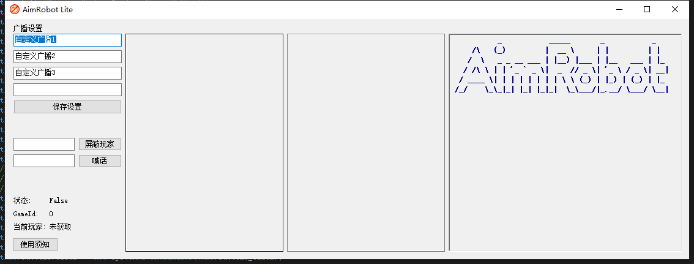

# AimRobotLite
This is a server manage tool for Battlefield V 

这是一个基于Robot Mini、用于管理战地5服务器的程序。  
目的是为了使用精简版管理服务器的服主能更加方遍管理服务器。

 
  
  

 

*~~很喜欢某潜水员说的一句话：XXXXXX的一帮XX罢了，除了XX就是X，离了XX那XX就是X都不会X的XX。~~*

## 发电地址
**[爱发电](https://afdian.net/a/h4rry217)**

## 使用声明 
* AIM ROBOT LITE (以下简称ARL) 是一个基于Robot Mini的机器人增强程序。ARL程序不会也不打算增加带有权限性质的功能。
* **ARL程序并无注入游戏等操作功能，原则上不会因为ARL程序本身而被封禁，但仍不保证其安全性，如果你在使用ARL时被封禁了，ARL程序和ARL作者不会对此负责。**
* ARL程序免费发布给所有人，作者不会以ARL程序的名义收取带有目的性质的收费（但你可以在爱发电上赞助这个程序，不过这个赞助不会让你获得任何东西）。
* ARL程序将会之后迟一些的某一天开源（已同BFV ROBOT社区相关人士沟通过）。  

__AimRobotLite可执行程序及其后续发布源码采用AGPL3.0协议发布。强烈建议使用者做到以下几点：__  
* 不在服名带有`[BFV ROBOT]`前缀或 __高度形似__ 类似前缀的服务器（如BEV、BFU、BF5等）使用ARL程序
* 不与ARL程序进行间接接触（包括但不限于使用 Http API、Hook技术、跨进程技术等）
* 不以ARL程序的名义对他人进行带有目的性质的收费

## 功能列表
- [x] 服务器广播循环
- [x] 火箭弹击杀播报（扔火箭弹后显示炸死了几个）
- [x] 防刷屏
- [x] 屏蔽BFBAN实锤玩家
- [x] KPM统计（!stat指令）
- [x] 禁用武器（如二式） 
- [ ] (可能添加) ARL的QQ机器人（提供源码及程序部署方式，包含如Q群喊话、Q群Ban人等）
- [ ] 玩家列表查询（从内存读取玩家列表并显示至ARL）~~已完成但未实装至ARL~~
- [ ] ~~自定义开发插件（可能会加入插件功能，允许使用者自己编写机器人逻辑，类似Mod）~~

*~~这电脑我买的，电费我出的，暖服也是我干的~~*

## 使用方法
1. 启动Robot Mini。
2. 再关闭Robot Mini了。
3. 开启AimRobotLite，当聊天框出现喊话时，代表完成启动。

Q: 为什么需要启动MINI版先？  
A: ARL当然可以简化这里的操作，但不简化的目的是为了让你每次启动都能清楚—— ~~(懒得弄)~~ __ARL是基于Robot Mini的增强而不是修改__。

需要注意的是，当你不在游戏中(如游戏主界面、武器界面等)，建议关闭程序（仅仅是建议）。

## 联系方式
如果程序使用途中出现BUG等问题，而你又不会在GitHub上开Issue，那么你可以通过 hcilnete@gmail.com 联系我

## 界面截图
V1.0.0版本

## 更新记录

### V1.0.1
新增 屏蔽使用二式的玩家（注意：当服主也使用二式时，程序将会自动退出）  
修复 屏蔽刷屏玩家不生效的问题